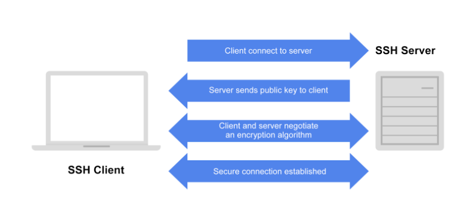

# Configuring SSH
Computer ports are software-based points where a network connection begins and ends. When using Secure Shell (SSH), the client connects to the server on port 22. After the connection is made, the server sends its public key to the client. Then the client and server negotiate a set of encryption rules, called an encryption algorithm, that both machines can support. When the two machines are in agreement on the encryption algorithm, the server starts a login shell for the user. 



## Configuring an SSH client
SSH configuration instructions will be different depending on your operating system and the implementation of SSH. On the other hand, instructions for a client to generate its SSH key and connect to a server are more general. Let’s look at how to set up the command-line OpenSSH client and connect to a remote host for the first time. 

### Generating your key pair
First, you will need to generate your public/private key pair. The first time you connect to a given server using SSH, the server will store a copy of its public key on your machine. This needs to be done only once, as the same key pair can be used to connect to any number of remote hosts.

Open a terminal and enter the command: 

```bash
ssh-keygen -t rsa -b 2048
```
OpenSSH will ask where to save the generated keys. Note that it will create a hidden directory called .ssh in your home directory. You can accept the defaults here. 

SSH will also ask you for a passphrase to protect your key. Many people choose not to use a passphrase because if you enter a passphrase here, you will be required to enter it every time your key is used. If you are on a machine that is not secure, however, someone who gains access to that computer will also have access to every system that uses that key. 

If you add a passphrase to your SSH key for added security, you can save the passphrase to an SSH agent, which is a program that manages SSH keys. For more about working with SSH key passphrases, see 
[Adding your SSH key to the ssh-agent](https://docs.github.com/en/authentication/connecting-to-github-with-ssh/generating-a-new-ssh-key-and-adding-it-to-the-ssh-agent#adding-your-ssh-key-to-the-ssh-agent)

After you have set your passphrase or declined the option, OpenSSH will then generate a random public/private key pair and save it. Depending on your hardware, this may take several seconds to complete. OpenSSH will then return a message that your key has been saved and display the fingerprint and a “randomart image” of your new key. Here is an example:
```bash
Generating public/private rsa key pair.
Enter file in which to save the key (/Users/tradel/.ssh/id_rsa): 
Created directory '/Users/tradel/.ssh'.
Enter passphrase (empty for no passphrase): 
Enter same passphrase again: 
Your identification has been saved in /Users/tradel/.ssh/id_rsa
Your public key has been saved in /Users/tradel/.ssh/id_rsa.pub
The key fingerprint is:
SHA256:0P4GpCFXlVoZPoQ8ULdqq9L0p2KTYlMwtOLXIwSxfO8 tradel@Artwalker-MacBook-Pro.local
The key's randomart image is:
+---[RSA 2048]----+
|  ..  .+oo=+     |
| ....  o+++.     |
|  ooo.+ o++      |
|  ..=+ *.. .     |
| . o +o S        |
|  . o.=. +       |
|   . =E+. o      |
|    = *....      |
|   . =.o.o       |
+----[SHA256]-----+
```
## Connecting for the first time
Now that you have a key pair, you can connect to a host. The most basic form of the command to connect is: 
```bash
ssh <username>@<hostname>.
```
When you connect to a server for the first time, SSH will print out the fingerprint of the remote server’s key and confirm that you really want to connect. The request will look like this:
```bash
The authenticity of host 'my-host (192.168.1.10)' can't be established.
ED25519 key fingerprint is SHA256:KyE8fOzengv6CRTe1EXaeO7dtIF9JKM0VAcKf6sA0RM.
This key is not known by any other names
Are you sure you want to continue connecting (yes/no/[fingerprint])? yes
Warning: Permanently added 'my-host' (ED25519) to the list of known hosts.
```
You may be asked to enter the password for the account on the remote host. After you do this, a copy of your public key will be stored on the host, and you will not have to enter your password again. Your own copy of your key is sufficient to authenticate your connection. 

## Configuring an SSH server
As we said earlier, SSH server configuration will vary based on your operating system and implementation of SSH. The SSH server component, called a “daemon,” is often installed by default on Linux and Unix. On Linux, the server configuration file is usually at `/etc/ssh/sshd_config` and rarely needs to be changed. 

If you try to connect to a host and see an error like “`ssh: connection refused`”, consult your operating system documentation for how to install and enable the SSH daemon. 

For use cases like increased security or managing user connections, see 
[How To Tune your SSH Daemon Configuration on a Linux VPS.](https://www.digitalocean.com/community/tutorials/how-to-tune-your-ssh-daemon-configuration-on-a-linux-vps)

Later versions of MacOS also have a command-line SSH client already installed. For a free implementation of SSH for Windows, Mac, and Unix, see [PuTTY: a free SSH and Telnet client](https://www.chiark.greenend.org.uk/~sgtatham/putty/)


## Pro Tips 
You can use the same private/public key pair across all the machines you control. So if you have two laptops and a tablet, you could copy your key pair to all of them. This can save you a few steps when logging in from other devices.

Once SSH is set up, if the public key sent by the server ever changes, SSH will warn you that something malicious may have happened to the server. You will receive an alert message that states the “Remote host identification has changed” or similar. You should contact your systems administrator if you see this message. Although it’s possible that the server has simply updated its key, it’s also possible that someone is eavesdropping on communications between you and an application in order to steal information. 

Optional features like port forwarding are often disabled by default because they open up potential security holes if they are misused. You may need these optional features to be enabled for something like forwarding network ports from a remote host to your local machine; for instance, if you want to access a service on the host (or the host's network) that is blocked by a firewall. If you need these optional features enabled, turn them on in the `sshd_config` file.
